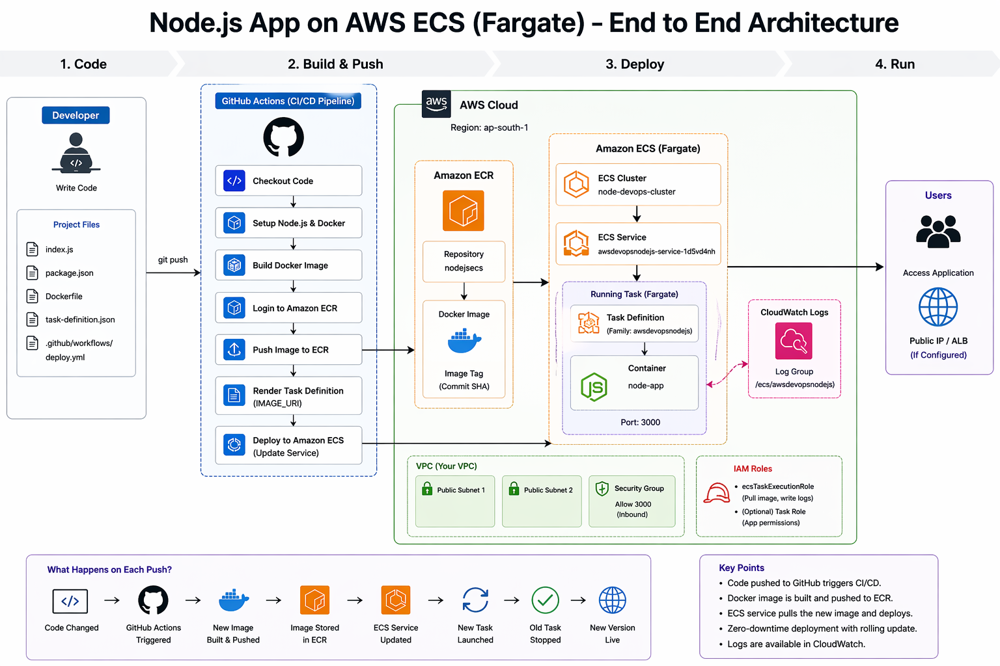
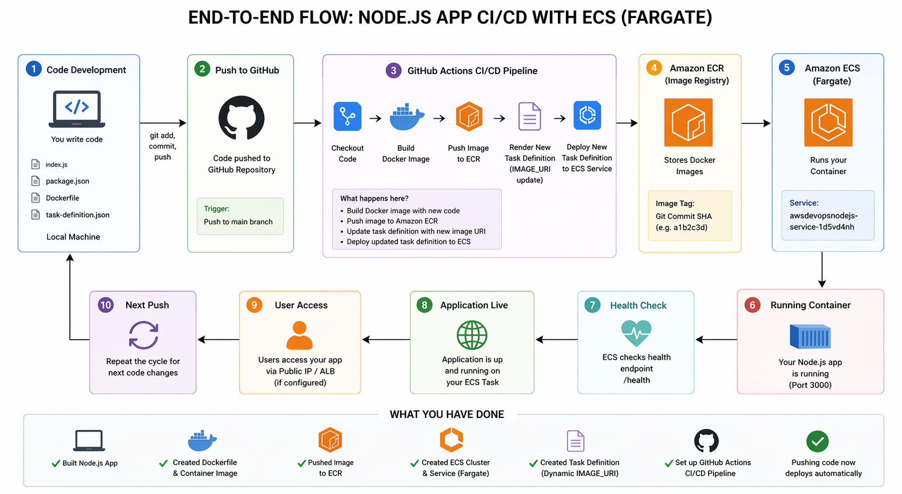

# AWS CI/CD Node Service

Production-style Node.js service deployed to Amazon ECS Fargate with container images stored in Amazon ECR and automated delivery through GitHub Actions.

## Architecture Images

## Data Flow Diagram

## What This Project Does

- Runs an Express service on port 3000.
- Builds a Docker image for every release tag.
- Pushes the image to Amazon ECR.
- Renders a new ECS task definition with the new image.
- Deploys the updated task to an ECS service.

## Architecture

~~~text
Tag Push (v*)
-> GitHub Actions
-> Docker Build
-> Amazon ECR
-> ECS Task Definition Render
-> Amazon ECS Service Update (Fargate)
~~~

## Tech Stack

- Node.js 18
- Express
- Docker
- Amazon ECR
- Amazon ECS Fargate
- GitHub Actions

## Repository Structure

~~~text
.
|- .github/workflows/deploy.yml
|- Dockerfile
|- index.js
|- package.json
|- package-lock.json
|- task-definition.json
|- buildspec.yml
|- appspec.yml
|- scripts/start.sh
|- test.js
`- README.md
~~~

## Application Endpoints

- GET / -> hello response
- GET /health -> health check
- GET /live -> liveness check
- GET /ready -> readiness check

Default local URL: http://localhost:3000

## Run Locally

### Option 1: Node.js

~~~bash
npm install
npm start
~~~

### Option 2: Docker

~~~bash
docker build -t aws-cicd-node-app .
docker run --rm -p 3000:3000 aws-cicd-node-app
~~~

## CI/CD Workflow

Workflow file: .github/workflows/deploy.yml

Deployment trigger:

- Push a tag that starts with v

Example release:

~~~bash
git tag v1.0.0
git push origin v1.0.0
~~~

Pipeline steps:

1. Checkout repository code.
2. Configure AWS credentials.
3. Login to ECR.
4. Build and push Docker image tagged with commit SHA.
5. Inject image URI into task definition.
6. Deploy updated task definition to ECS service.

## Required GitHub Secrets

Configure these repository secrets:

- AWS_ACCESS_KEY_ID
- AWS_SECRET_ACCESS_KEY
- AWS_REGION
- ECR_REPOSITORY
- ECS_CLUSTER
- ECS_SERVICE

## ECS Task Definition Notes

- Family: awsdevopsnodejs
- Container name: node-app
- Launch type: FARGATE
- Port mapping: 3000/tcp
- Image is replaced at deploy time from IMAGE_URI placeholder

Keep the container name as node-app in both task definition and workflow.

## Additional Deployment Files

This repository also includes:

- buildspec.yml
- appspec.yml
- scripts/start.sh

These files are commonly used in AWS CodeBuild or CodeDeploy style pipelines. Your active automated deployment to ECS is currently handled by GitHub Actions.

## Rollback Strategy

1. Open ECS in AWS Console.
2. Open Task Definitions and choose an older revision.
3. Update the ECS service to use that revision.
4. Wait for service stability.

## Troubleshooting

- Pipeline did not start:
- Check that you pushed a tag matching v pattern.
- ECS deployment fails:
- Validate ECS cluster and service secret values.
- Confirm IAM user has ECR and ECS permissions.
- Health check fails in ECS:
- task-definition.json uses curl for health checks.
- Ensure curl exists in the container image, or change health command.

## Quick Improvement Ideas

- Add a real test command in package.json and implement tests in test.js.
- Add an Application Load Balancer target group health check.
- Add CloudWatch alarms and ECS auto scaling policies.
- Add image scanning and dependency scanning in CI.

## License

ISC
